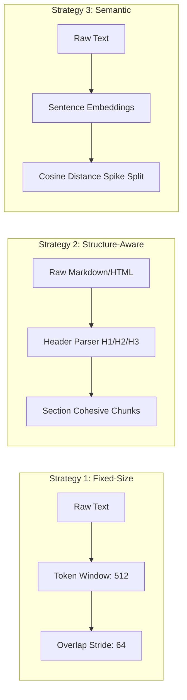
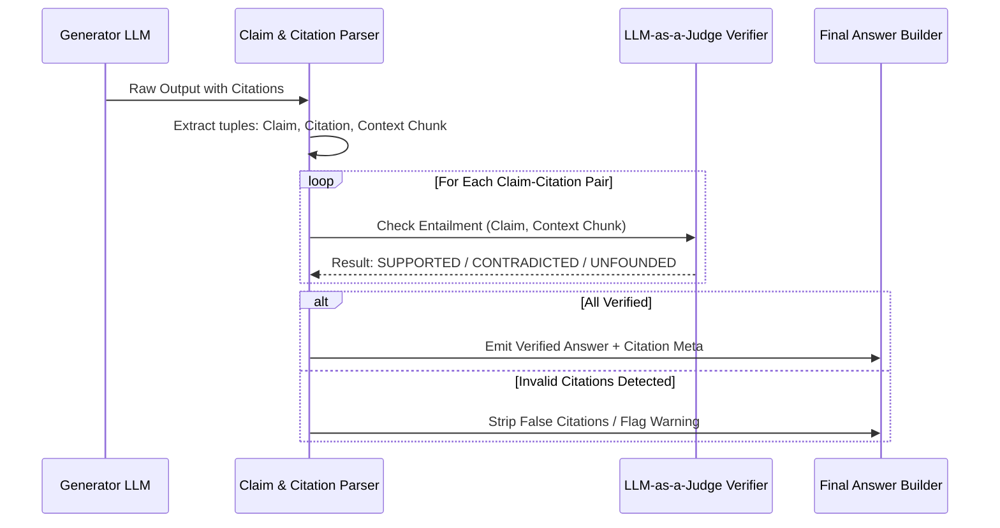

# Enterprise Hybrid RAG System Architecture Blueprint

## 1. System Overview & Architectural Objectives

The **Enterprise Hybrid RAG System** is an enterprise-grade retrieval-augmented generation engine designed specifically for semi-structured and technical internal documentation (API docs, runbooks, RFCs, architectural designs, incident retrospectives).

### Key Architectural Tenets:
1. **Zero Hallucination Tolerance:** Enforced via deterministic context bounding, citation-to-claim entailment checking, and automated refusal when retrieval confidence is low.
2. **Dual Representation Search:** Balanced high-recall semantic retrieval (Dense Vector Space) combined with exact-match lexical precision (Sparse BM25 Inverted Index).
3. **Chunking Strategy Agility:** Dynamic chunking profiles (Fixed-Size Overlap, Structure-Aware Header Splitting, Semantic Topic Splitting) with complete provenance tracking.
4. **Sub-Second Low Latency:** Fast stage-1 retrieval (top 20 candidates per query in < 25ms) followed by an optimized stage-2 Cross-Encoder reranker (< 60ms).
5. **Evaluation Driven:** End-to-end telemetry and automated evaluation suite tracking Groundedness, Faithfulness, Relevance, and Citation Precision.

---

## 2. Detailed Architectural Topology

```
+----------------------------------------------------------------------------------------------------+
|                                    INGESTION & INDEXING PIPELINE                                   |
+----------------------------------------------------------------------------------------------------+
| Raw Files:             [ Markdown ]       [ PDF Documents ]       [ HTML Pages ]       [ Text ]     |
|                             |                     |                     |                 |        |
| Normalization:              +---------------------+---------------------+-----------------+        |
|                                                   |                                                |
|                                                   v                                                |
|                                     [ Unified Document Parser ]                                    |
|                                     - Strip boilerplates / scripts                                 |
|                                     - Extract structural hierarchy (H1..H4)                        |
|                                     - Preserve code blocks & tables                                |
|                                                   |                                                |
|                                                   v                                                |
|                                      [ Chunking Strategy Selector ]                                |
|                            +----------------------+-----------------------+                        |
|                            |                      |                       |                        |
|                     [ Fixed-Size ]      [ Structure-Aware ]         [ Semantic ]                   |
|                     - 512 tokens        - Markdown / HTML           - Sentence sliding window      |
|                     - 64 overlap          header boundary           - Cosine gap > threshold       |
|                            |                      |                       |                        |
|                            +----------------------+-----------------------+                        |
|                                                   |                                                |
|                                                   v                                                |
|                                    [ Near-Duplicate Deduplicator ]                                 |
|                                    - Cosine Sim > 0.95 Filter                                      |
|                                    - Document SHA256 Lineage Check                                 |
|                                                   |                                                |
|                         +-------------------------+-------------------------+                      |
|                         |                                                   |                      |
|                         v                                                   v                      |
|             [ Dense Vector Store ]                                [ Sparse BM25 Index ]            |
|             - ChromaDB / Qdrant                                   - rank_bm25 (BM25Okapi)          |
|             - text-embedding-3-small                              - Technical tokenization         |
|             - Metadata: src, chunk_idx, section                   - Preserved case for identifiers |
+----------------------------------------------------------------------------------------------------+
                                                    |
                                                    v
+----------------------------------------------------------------------------------------------------+
|                                  HYBRID RETRIEVAL & FUSION ENGINE                                  |
+----------------------------------------------------------------------------------------------------+
| User Query (Q) ───────────────────────────+─────────────────────────────────────────+              |
|                                           |                                         |              |
|                                           v                                         v              |
|                             [ Dense Vector Query ]                    [ Sparse BM25 Query ]        |
|                             - Query Embedding (1536d)                 - Tokenized Query Vector     |
|                             - Cosine Similarity Top-K (K=15)          - BM25 Scoring Top-K (K=15)  |
|                                           |                                         |              |
|                                           +--------------------+--------------------+              |
|                                                                |                                   |
|                                                                v                                   |
|                                               [ Reciprocal Rank Fusion (RRF) ]                     |
|                                               - RRF(d) = sum( w_i / (60 + rank_i(d)) )             |
|                                               - Weighted: 0.70 Dense / 0.30 Sparse                 |
|                                               - Produces Top-20 Candidate Chunks                   |
|                                                                |                                   |
|                                                                v                                   |
|                                              [ Cross-Encoder Stage-2 Reranker ]                    |
|                                              - ms-marco-MiniLM-L-6-v2                              |
|                                              - Full Cross-Attention (Query, Chunk_i)               |
|                                              - Selects Top-5 High-Precision Chunks                 |
+----------------------------------------------------------------------------------------------------+
                                                    |
                                                    v
+----------------------------------------------------------------------------------------------------+
|                                GENERATION & CITATION VERIFICATION                                  |
+----------------------------------------------------------------------------------------------------+
| Formatted Context:                                                                                 |
| [1] File: auth.md | Section: # Token Expiry | Text: JWT tokens expire after 3600 seconds...        |
| [2] File: db.md   | Section: # Pool Sizing  | Text: Maximum connection pool size is 50...          |
|                                                   |                                                |
|                                                   v                                                |
|                                        [ Grounded LLM Prompt ]                                     |
|                                        - Strict Context-Only Answering Rule                        |
|                                        - Mandatory Bracketed Citations [1], [2]                    |
|                                        - Explicit Fallback when Context is Insufficient            |
|                                                   |                                                |
|                                                   v                                                |
|                                      [ LLM Generator (GPT-4o) ]                                    |
|                                                   |                                                |
|                                                   v                                                |
|                                       [ Citation Verification ]                                    |
|                                 - Regex & AST parse [n] references                                 |
|                                 - Claim-to-Context Entailment Judge                                |
|                                 - Flag / drop unsupported citations                                |
|                                                   |                                                |
|                                                   v                                                |
|                                      [ Composite Confidence Scorer ]                               |
|                                 - Retrieval Score (40%)                                            |
|                                 - Citation Entailment (35%)                                        |
|                                 - Completeness Check (25%)                                         |
|                                                   |                                                |
|                               +-------------------+-------------------+                            |
|                               |                                       |                            |
|                     [ Score >= Threshold ]                  [ Score < Threshold ]                  |
|                               |                                       |                            |
|                               v                                       v                            |
|                 [ Verified Response Package ]           [ Structured Graceful Fallback ]           |
|                 - Answer with valid citations           - Partial findings statement               |
|                 - Source document links                 - Search blindspot report                  |
|                 - Confidence breakdown                  - Suggested internal documents             |
+----------------------------------------------------------------------------------------------------+
```

---

## 3. Subsystem Breakdown & Specifications

### Phase 1: Ingestion, Chunking & Deduplication Layer

#### 1. Multi-Format Ingestion Engine (`src/ingestion/parsers.py`)
- **Supported Formats:**
  - Markdown (`.md`, `.mdx`): Preserves header hierarchy `#`..`####`, code fences, lists, tables.
  - HTML (`.html`, `.htm`): Cleans scripts/styles, extracts clean DOM body, maintains `<h1>`-`<h6>` structure.
  - PDF (`.pdf`): Extracts textual streams per page, captures bounding metadata (Page Number, Doc Title).
  - Plaintext (`.txt`, `.log`): Sanitized raw UTF-8 parsing.
- **Normalization Pipeline:**
  - Strip redundant whitespace and carriage returns.
  - Standardize unicode characters (e.g., quotes, dashes, non-breaking spaces).
  - Store original file hash (`SHA256`) and raw document artifacts in `data/raw/` for idempotent re-indexing.

#### 2. Configurable 3-Tier Chunking Engine (`src/ingestion/chunkers.py`)



1. **Fixed-Size Overlap Chunking (Baseline):**
   - Chunk Size: 512 tokens.
   - Chunk Overlap: 64 tokens.
   - Tokenizer: `tiktoken` (cl100k_base).
2. **Structure-Aware Recursive Header Splitting:**
   - Splits on hierarchy: `# Header 1` $\rightarrow$ `## Header 2` $\rightarrow$ `### Header 3` $\rightarrow$ Paragraphs $\rightarrow$ Sentences.
   - Enforces minimum chunk size (100 tokens) to prevent orphaned titles, and maximum chunk size (800 tokens) with internal sentence splitting.
   - Prepends parent breadcrumb headers (e.g., `Authentication > OAuth2 > Refresh Token Flow`) to every sub-chunk to preserve semantic context.
3. **Semantic Topic Boundary Chunking:**
   - Segment input into individual sentences: $S = [s_1, s_2, ..., s_n]$.
   - Compute sentence embeddings $E(s_i)$ using `text-embedding-3-small`.
   - Calculate sliding cosine distance between window vectors:
     $$d_i = 1 - \cos(E(s_i), E(s_{i+1}))$$
   - Identify transition breakpoints where $d_i > \mu_d + k \cdot \sigma_d$ (e.g., $90\text{th}$ percentile threshold).
   - Group sentences between breakpoints into topic-coherent chunks.

#### 3. Near-Duplicate Deduplication Filter (`src/ingestion/deduplicator.py`)
- Before adding a chunk $c_{\text{new}}$ to the indices:
  1. Compute embedding vector $\vec{v}_{\text{new}}$.
  2. Query existing index for the nearest neighbor within cosine similarity radius:
     $$\cos(\vec{v}_{\text{new}}, \vec{v}_{\text{existing}}) \ge 0.95$$
  3. If similarity exceeds $0.95$, mark chunk as duplicate, record parent doc reference, and omit from insertion.
  4. Prevents context degradation from boilerplate disclaimers, duplicate changelogs, or cloned repositories.

---

### Phase 2: Hybrid Retrieval & Fusion Layer

#### 1. Dual Index Management
- **Dense Vector Store (`src/retrieval/dense_store.py`):**
  - Backend: ChromaDB (Embedded / Server) or Qdrant.
  - Dimension: 1536 (OpenAI `text-embedding-3-small`) with HNSW index ($M=16, efSearch=64$).
  - Stored Payload: `doc_id`, `chunk_id`, `chunk_text`, `source_file`, `section_title`, `strategy`, `token_count`.
- **Sparse Inverted Index (`src/retrieval/sparse_store.py`):**
  - Backend: `rank_bm25.BM25Okapi` with custom tokenizer.
  - Tokenizer rules: Preserves snake_case (`auth_token_secret`), kebab-case (`k8s-service-account`), and CamelCase (`DatabaseConnectionPool`).
  - Serialized to disk alongside vector database for synchronized cold restarts.

#### 2. Reciprocal Rank Fusion (RRF) & Weighted Hybrid Search (`src/retrieval/fusion.py`)
Given user query $q$:
1. Retrieve top-$K$ ($K=15$) from Dense Store: $\mathcal{R}_{\text{dense}} = \{d_{d,1}, d_{d,2}, ..., d_{d,K}\}$.
2. Retrieve top-$K$ ($K=15$) from Sparse Index: $\mathcal{R}_{\text{sparse}} = \{d_{s,1}, d_{s,2}, ..., d_{s,K}\}$.
3. Compute fused rank score for each unique document $d \in \mathcal{R}_{\text{dense}} \cup \mathcal{R}_{\text{sparse}}$:
   $$\text{Score}_{\text{RRF}}(d) = \frac{w_{\text{dense}}}{k + \text{rank}_{\text{dense}}(d)} + \frac{w_{\text{sparse}}}{k + \text{rank}_{\text{sparse}}(d)}$$
   *(where smoothing constant $k = 60$, $w_{\text{dense}} = 0.70$, $w_{\text{sparse}} = 0.30$ by default).*
4. Rank all candidates by $\text{Score}_{\text{RRF}}(d)$ and pass the top 20 candidates to the Reranker.

#### 3. Cross-Encoder Stage-2 Reranking (`src/retrieval/reranker.py`)
- Candidate Pool: Top 20 chunks from RRF.
- Cross-Encoder Model: `cross-encoder/ms-marco-MiniLM-L-6-v2` (or HuggingFace local inference / LLM scoring).
- Computes cross-attention logits $s_i = \text{CrossEncoder}(q, c_i)$ for all 20 pairs.
- Truncates to final top-5 ($k_{\text{final}}=5$) highest-scoring chunks for prompt context assembly.

---

### Phase 3: Grounded Generation, Verification & Confidence Layer

#### 1. Grounded Generation Prompt Architecture (`src/generation/prompt_templates.py`)
The system prompt strictly constrains LLM output:
- Must only answer using information explicitly contained within provided numbered chunks `[1]` to `[N]`.
- Must insert bracketed citation tags `[1]`, `[2]` immediately following each asserted fact or claim.
- Must not speculate, extrapolate, or utilize prior knowledge outside the context.
- If the context does not contain sufficient details to answer all aspects of the query, it must state what is missing.

#### 2. Citation & Claim Entailment Verification (`src/generation/citation_verifier.py`)


- **Deconstruction:** The answer is parsed into atomic assertions: $A = \{a_1, a_2, ..., a_m\}$ where each assertion $a_i$ maps to citation tags $\mathcal{C}_i \subseteq \{1, 2, ..., N\}$.
- **Verification Judge:** For each pair $(a_i, \text{Chunk}_j)$, the verifier prompt evaluates:
  $$\text{Verdict}(a_i, \text{Chunk}_j) \in \{\text{SUPPORTED}, \text{PARTIALLY-SUPPORTED}, \text{UNSUPPORTED}\}$$
- If a citation is $\text{UNSUPPORTED}$, it is flagged in the metadata and stripped from the user-facing text to prevent false authority.

#### 3. Answer Confidence Scoring Engine (`src/generation/confidence_scorer.py`)
Calculates a composite confidence score $S \in [0.0, 1.0]$:
$$S = w_1 \cdot S_{\text{retrieval}} + w_2 \cdot S_{\text{citation-grounding}} + w_3 \cdot S_{\text{completeness}}$$

- **Retrieval Relevance ($S_{\text{retrieval}}$):** Normalized average cross-encoder score of top 3 chunks.
- **Citation Grounding ($S_{\text{citation-grounding}}$):** $\frac{\text{Count of Supported Citations}}{\text{Total Citations Generated}}$.
- **Answer Completeness ($S_{\text{completeness}}$):** Heuristic or LLM judgment assessing if the generated answer addressed all question sub-clauses.

**Graceful Degradation Threshold:**
- If $S < 0.60$: The system returns an honest, structured fallback:
  ```json
  {
    "status": "insufficient_context",
    "message": "The internal documentation does not contain enough verified evidence to answer your question with confidence.",
    "searched_topics": ["Vault secret rotation", "DB connection timeouts"],
    "relevant_documents_found": ["security/vault_ops.md (Section 3.1)"],
    "missing_information": "Exact timeout limits for pool draining."
  }
  ```

---

### Phase 4: Evaluation & Benchmarking Architecture (`src/evaluation/`)

```
+-------------------------------------------------------------------------+
|                       GOLDEN TEST DATASET (50+ Pairs)                  |
|  - Exact Lookups (20)                                                   |
|  - Multi-Hop Cross-Document Inferences (15)                             |
|  - Unanswerable / Out-of-Domain Queries (10)                            |
|  - Ambiguous / Technical Acronym Lookups (10)                           |
+-------------------------------------------------------------------------+
                                    │
                                    ▼
+-------------------------------------------------------------------------+
|                       BENCHMARK RUNNER & METRIC SUITE                   |
|                                                                         |
|  1. Retrieval Metrics:                                                  |
|     - Hit Rate @ K (K=3, 5, 10)                                         |
|     - Mean Reciprocal Rank (MRR)                                        |
|     - Normalized Discounted Cumulative Gain (NDCG@5)                    |
|                                                                         |
|  2. Generation & Grounding Metrics:                                     |
|     - Answer Correctness (Semantic Similarity / Golden Match)           |
|     - Faithfulness / Groundedness (LLM-as-a-Judge)                      |
|     - Citation Precision & Recall                                       |
|     - Refusal Accuracy on Unanswerable Queries                          |
+-------------------------------------------------------------------------+
                                    │
                                    ▼
+-------------------------------------------------------------------------+
|                  STRATEGY COMPARISON & ABLATION MATRIX                  |
|  - Fixed-Size vs. Structure-Aware vs. Semantic                          |
|  - Dense-Only vs. BM25-Only vs. Hybrid vs. Hybrid + Reranker            |
+-------------------------------------------------------------------------+
```

---

## 4. API & Deployment Architecture

### REST Service Endpoints (`src/api/`)
- `POST /v1/ask`: Main inference endpoint accepting user questions, hybrid parameters, and chunking strategy overrides.
- `POST /v1/ingest`: File upload and ingestion pipeline trigger.
- `GET /v1/documents`: List indexed documents, chunk distributions, and index health stats.
- `GET /v1/chunking/compare`: Runs an on-the-fly query across all 3 chunking strategies side-by-side for comparison.
- `GET /healthz`: System liveness and vector store readiness check.

### Phase 5: Angular Modern Dashboard & API Architecture

```
+----------------------------------------------------------------------------------------------------+
|                                    ANGULAR 17+ SPA DASHBOARD                                       |
+----------------------------------------------------------------------------------------------------+
|  [ Modern Navigation Header: Status Badges, Model Selector, Dark Glassmorphism Theme ]             |
|                                                                                                    |
|  +----------------------------------------------------------------------------------------------+  |
|  | [ SearchBarComponent ]: Real-time query input, hybrid weight sliders (Dense/Sparse),        |  |
|  |                          chunking strategy dropdown, reranker toggle                         |  |
|  +----------------------------------------------------------------------------------------------+  |
|                                                                                                    |
|  +---------------------------------------------------+  +---------------------------------------+  |
|  | [ AnswerViewComponent ]                           |  | [ ConfidenceGaugeComponent ]          |  |
|  | - Markdown formatted answer                       |  | - Composite radial gauge (0-100%)     |  |
|  | - Interactive bracket citation chips [1], [2]     |  | - Retrieval Relevance (40%)           |  |
|  | - Citation validation badges (✓ Verified / ✗ Flag)|  | - Citation Grounding (35%)            |  |
|  | - Graceful fallback callouts                      |  | - Answer Completeness (25%)           |  |
|  +---------------------------------------------------+  +---------------------------------------+  |
|                                                                                                    |
|  +----------------------------------------------------------------------------------------------+  |
|  | [ CitationDrawerComponent ]: Collapsible chunk inspection, source document links,            |  |
|  |                              section breadcrumbs, BM25 score & Cross-Encoder logit details   |  |
|  +----------------------------------------------------------------------------------------------+  |
|                                                                                                    |
|  +----------------------------------------------------------------------------------------------+  |
|  | [ ComparisonToggleComponent ]: Side-by-side comparative inspection: Dense-Only vs Hybrid RRF |  |
|  +----------------------------------------------------------------------------------------------+  |
|                                                                                                    |
|  [ RagApiService (RxJS) ]: Async HTTP Client with typed DTOs, retry policies, and error boundaries|
+----------------------------------------------------------------------------------------------------+
```

### Production Container Topology (`docker-compose.yml`)
1. **`rag-api`**: FastAPI Python 3.11 asynchronous backend service (`http://localhost:8000`).
2. **`chroma-db`**: Persistent vector database instance (`http://localhost:8000/data/chroma_db`).
3. **`rag-ui-angular`**: Angular 17+ single-page application served via Node / NGINX (`http://localhost:4200`).

