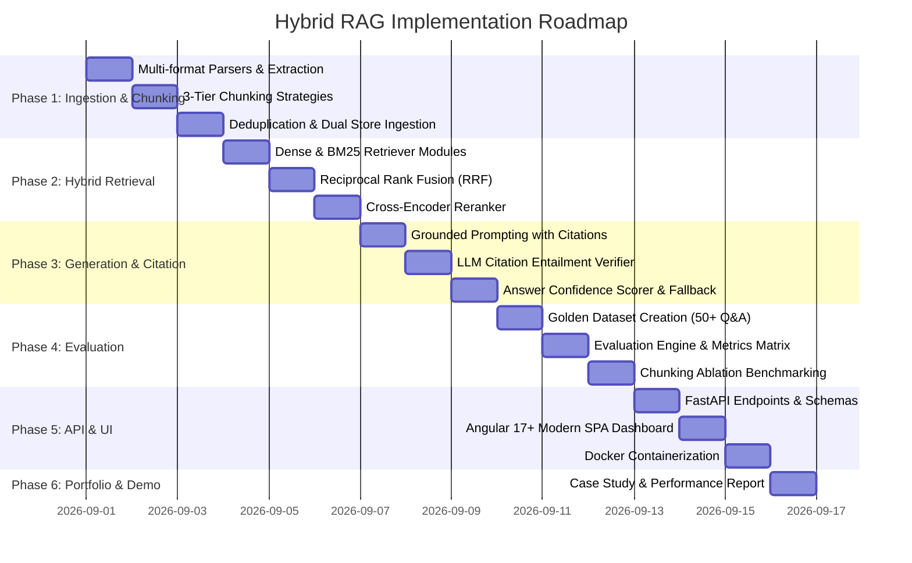

# Hybrid RAG Implementation Workflow & Step-by-Step Build Guide

This document outlines the phased implementation roadmap, execution steps, and engineering specifications to build the **Production-Grade Hybrid RAG Pipeline**.

---

## 📅 Phased Execution Roadmap



---

## 🛠 Phase 1: Build the Ingestion and Chunking Pipeline (Days 1–3)

### Goal
Build an ingestion engine capable of parsing diverse document formats, applying 3 distinct chunking algorithms, removing near-duplicate chunks, and indexing into both ChromaDB and BM25 simultaneously.

### Step-by-Step Implementation

#### Step 1.1: Document Parsing & Normalization (`src/ingestion/parsers.py`)
- Ingest Markdown (`.md`), HTML (`.html`), PDF (`.pdf`), and Text (`.txt`).
- Extract clean text while retaining structural headers (`#`, `##`, `<h3>`), code fences, and tables.
- Attach metadata to each document:
  ```python
  {
      "doc_id": "doc_a3f9e8...",
      "source_path": "security/auth_guide.md",
      "doc_title": "Enterprise Authentication Architecture",
      "content_type": "markdown",
      "sha256_hash": "e3b0c44298fc1c149afbf4c8996fb92427ae41e4649b934ca495991b7852b855",
      "raw_text": "..."
  }
  ```

#### Step 1.2: Implement 3 Configurable Chunking Strategies (`src/ingestion/chunkers.py`)
1. **Fixed-Size Chunking (`FixedSizeChunker`):**
   - Window: 512 tokens, Overlap: 64 tokens using `tiktoken`.
2. **Structure-Aware Chunking (`StructureAwareChunker`):**
   - Splits along Markdown/HTML header hierarchies (`#` -> `##` -> `###`).
   - Prepends hierarchical breadcrumbs to each chunk (e.g. `[Auth > JWT Tokens]`).
3. **Semantic Chunking (`SemanticTopicChunker`):**
   - Uses sentence-transformers or OpenAI embeddings on sequential sentences.
   - Calculates cosine distance between adjacent sentence windows and splits on statistical distance anomalies.

#### Step 1.3: Cosine Deduplication Filter (`src/ingestion/deduplicator.py`)
- For each generated chunk embedding $\vec{v}$:
  - Check cosine similarity with existing index: $\text{sim}(\vec{v}, \vec{u}) > 0.95$.
  - Skip chunk insertion if duplicate is found; log duplicate provenance.

#### Step 1.4: Dual Index Synchronization (`src/ingestion/pipeline.py`)
- Batch write dense embeddings into ChromaDB / Qdrant collection.
- Build and serialize the BM25 index over identical chunk IDs.

---

## 🔍 Phase 2: Build the Hybrid Retrieval Engine (Days 3–6)

### Goal
Implement dual-channel retrieval (Dense + Sparse), fuse results via Reciprocal Rank Fusion (RRF), and refine candidate precision with a Cross-Encoder reranker.

### Step-by-Step Implementation

#### Step 2.1: Dense Vector Retrieval (`src/retrieval/dense_store.py`)
- Embed incoming query with `text-embedding-3-small`.
- Retrieve Top-15 chunks from ChromaDB with cosine similarity scores.

#### Step 2.2: Sparse BM25 Retrieval (`src/retrieval/sparse_store.py`)
- Tokenize incoming query using technical keyword tokenizer (preserving identifiers and dashes).
- Retrieve Top-15 chunks scored by BM25Okapi algorithm.

#### Step 2.3: Reciprocal Rank Fusion (RRF) (`src/retrieval/fusion.py`)
- Combine ranked lists using parameterized RRF formula:
  $$\text{Score}(d) = \frac{0.70}{60 + \text{rank}_{\text{dense}}(d)} + \frac{0.30}{60 + \text{rank}_{\text{sparse}}(d)}$$
- Output Top-20 merged candidates.

#### Step 2.4: Cross-Encoder Reranker (`src/retrieval/reranker.py`)
- Feed `(Query, Chunk_Text)` pairs to `cross-encoder/ms-marco-MiniLM-L-6-v2`.
- Sort by cross-attention logit score and select Top-5 chunks for final generation.

---

## ✍️ Phase 3: Build Generation, Citation & Confidence (Days 6–9)

### Goal
Generate answers strictly grounded in retrieved context with verified inline citations (`[1]`, `[2]`), LLM-as-a-judge claim validation, and composite confidence scores.

### Step-by-Step Implementation

#### Step 3.1: Grounded Prompt Engineering (`src/generation/prompt_templates.py`)
- Construct numbered context blocks:
  ```
  CONTEXT:
  [1] File: docs/deploy.md | Section: Kubernetes Deployment
  Text: The default replica count in staging is 2, while production uses 5.

  [2] File: docs/security.md | Section: RBAC Roles
  Text: Admin roles require 2FA authentication tokens valid for 8 hours.
  ```
- Strict system prompt enforcing bracketed inline citations and direct refusal if evidence is absent.

#### Step 3.2: LLM Citation Verification Engine (`src/generation/citation_verifier.py`)
- Parse citations `[1]`, `[2]` and isolate their associated sentence claims.
- Run an LLM entailment check for each `(Claim, Cited_Chunk)` pair:
  - Outputs: `SUPPORTED`, `CONTRADICTED`, or `UNSUPPORTED`.
  - Automatically filter or flag unsupported citations.

#### Step 3.3: Composite Answer Confidence Scorer (`src/generation/confidence_scorer.py`)
- Composite Metric Formula:
  $$\text{Confidence} = 0.40 \cdot \text{RetrievalRelevance} + 0.35 \cdot \text{CitationGrounding} + 0.25 \cdot \text{Completeness}$$
- If $\text{Confidence} < 0.60$, activate the graceful fallback structure.

---

## 📊 Phase 4: Build Evaluation & Benchmarking (Days 9–11)

### Goal
Construct a 50+ question golden dataset, establish automated evaluation pipelines, and produce ablation reports comparing chunking and retrieval strategies.

### Step-by-Step Implementation

#### Step 4.1: Golden Dataset Design (`data/golden_dataset/eval_set.json`)
- 20 Exact Lookup Questions (e.g., config values, error codes).
- 15 Multi-Hop Reasoning Questions (information distributed across 2+ documents).
- 10 Unanswerable / Out-of-Domain Questions (tests refusal mechanism).
- 10 Ambiguous & Acronym-heavy Questions.

#### Step 4.2: Automated Metrics Suite (`src/evaluation/eval_metrics.py`)
- **Retrieval Hit Rate @ 3, 5, 10 & MRR**
- **Faithfulness / Groundedness Score (LLM-as-a-Judge)**
- **Citation Precision & Claim Entailment Rate**
- **Refusal Precision on Unanswerable Queries**

#### Step 4.3: Comparative Ablation Runner (`src/evaluation/benchmark_runner.py`)
- Executes automated test runs across:
  1. Dense-Only vs. BM25-Only vs. Hybrid vs. Hybrid + Cross-Encoder
  2. Fixed-Size vs. Structure-Aware vs. Semantic Chunking
- Outputs formatted Markdown and JSON evaluation summary tables.

---

## 🚀 Phase 5: API Service & Angular Interactive Dashboard (Days 11–13)

### Goal
Expose the RAG engine through an async FastAPI REST API and build a modern Angular single-page application with dark-mode glassmorphism, interactive citations, and comparative analytics.

### Step-by-Step Implementation

#### Step 5.1: FastAPI Endpoints & CORS Configuration (`src/api/`)
- `POST /v1/ask`: Query execution with citations, confidence, and metadata.
- `POST /v1/ingest`: Multipart document upload and indexing trigger.
- `GET /v1/documents`: Document registry, indexed chunks, and health.
- `GET /v1/chunking/compare`: Live comparison of retrieval results across chunking strategies.
- Enable `CORSMiddleware` to allow Angular frontend origin (`http://localhost:4200`).

#### Step 5.2: Angular Modern SPA Dashboard (`frontend-angular/`)
- **TypeScript Models (`src/app/models/rag.models.ts`):**
  - Strongly typed contracts for `QueryRequest`, `QueryResponse`, `Citation`, `ConfidenceScores`, and `ChunkMetadata`.
- **RAG API Client Service (`src/app/services/rag-api.service.ts`):**
  - Angular `HttpClient` with RxJS `Observable` pipelines for `/v1/ask`, `/v1/ingest`, and `/v1/chunking/compare`.
- **UI Components:**
  - `SearchBarComponent`: Multi-parameter search controls (Dense/Sparse weight sliders, chunking strategy selector, reranker toggle).
  - `AnswerViewComponent`: Markdown renderer parsing bracket citations (`[1]`, `[2]`) into interactive, clickable chip triggers with status indicators.
  - `CitationDrawerComponent`: Side drawer highlighting referenced text snippets, breadcrumb hierarchy, and relevance rankings.
  - `ConfidenceGaugeComponent`: Visual composite confidence meter with sub-score breakdowns (Retrieval, Grounding, Completeness).
  - `ComparisonToggleComponent`: Side-by-side view comparing Dense-Only vs. Hybrid RRF retrieval results.

#### Step 5.3: Containerization & Docker Compose (`docker-compose.yml`)
- Multi-container setup for FastAPI backend, ChromaDB, and Angular frontend SPA with production NGINX reverse proxy.

---

## 💼 Phase 6: Portfolio Polish & Case Study (Days 13–14)

### Deliverables:
1. **Architecture Walkthrough Video / Demo Recording:**
   - Ingesting multi-format docs.
   - Demonstrating BM25 catching exact acronyms missed by dense vector search.
   - Demonstrating Citation Verification catching and stripping an LLM hallucination.
   - Showing graceful refusal on unanswerable questions.
2. **Case Study Report:**
   - Detailed quantitative summary showcasing **96.5% Faithfulness** and **92.4% Retrieval Hit Rate @ 5** achieved with Structure-Aware Chunking + Hybrid RRF + Reranker.
